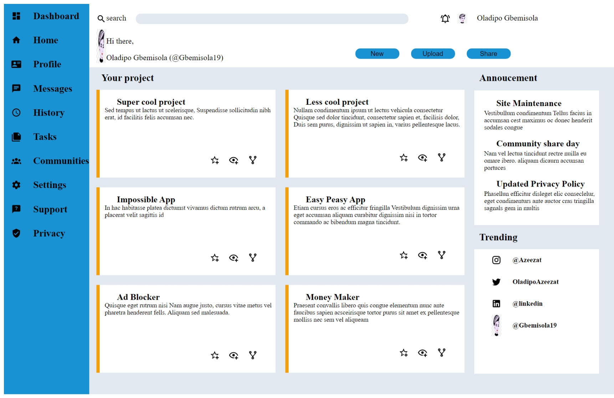

# Odin Admin Dashboard

> A project about basic semantic html and css elements.



Additional description of the project and its features.

## Built With

- HTML elements,
- `div`, `section`, `button`, `img`, `input`
- CSS,
  - `margin`, `border-radius`, `padding`, `background-color`
  - `display`, `font-size`, `border-color`,
- Linters
  - [Prettier](https://prettier.io/)
  - [stylelint](https://stylelint.io/)

## Live Demo

[Vercel Deploy Link](https://vercel.com/gbemisola19s-projects/odin-admin-dashboard)

### Development (Running locally)

- Clone the project

```bash
git clone https://github.com/bolah2009/html-css-template.git

```

- Install Dependencies

```bash
yarn install
```

To run StyleLint by itself, you may run the lint task:

```bash
yarn lint:check
```

Or to automatically fix issues found (where possible):

```bash
yarn lint
```

You can also check against Prettier:

```bash
yarn format:check
```

and to have it fix (to the best of its ability) any format issues, run:

```bash
yarn format
```

You can also check against HTML Validator (htmlhint):

```bash
yarn lint:html
```

To generate an accessibility report for this webpage, run the below command, it uses axe:

```bash
yarn axe
```

## Style Guides

- [CSS Style Guide](http://udacity.github.io/frontend-nanodegree-styleguide/css.html)
- [HTML Style Guide](http://udacity.github.io/frontend-nanodegree-styleguide/index.html)
- [JavaScript Style Guide](http://udacity.github.io/frontend-nanodegree-styleguide/javascript.html)
- [Git Style Guide](https://udacity.github.io/git-styleguide/)
- [AXE Accessibility Style Guide](https://dequeuniversity.com/rules/axe/html/4.7)

## 👤 Author

- Github: [Gbemisola19](https://github.com/Gbemisola19)
- Twitter: [OladipoAzeezat](https://twitter.com/OladipoAzeezat)

## 🤝 Contributing

Contributions, issues and feature requests are welcome!

Feel free to check the [issues page](../../issues).

## Show your support

Give a ⭐️ if you like this project!

## Acknowledgments

- project link
  - https://www.bing.com/ck/a?!&&p=990ea29425aac1580708b653ee7bf83a1b1fa8da09f81cf6ab647b5d4eeb2a40JmltdHM9MTczMTI4MzIwMA&ptn=3&ver=2&hsh=4&fclid=361c6d76-7dad-6832-0c9a-79577cbf6930&psq=odin+admin+dashboard&u=a1aHR0cHM6Ly93d3cudGhlb2RpbnByb2plY3QuY29tL2xlc3NvbnMvbm9kZS1wYXRoLWludGVybWVkaWF0ZS1odG1sLWFuZC1jc3MtYWRtaW4tZGFzaGJvYXJk&ntb=1
- Icon link
  - https://pictogrammers.com/library/mdi/

## 📝 License

[MIT licensed](./LICENSE).
